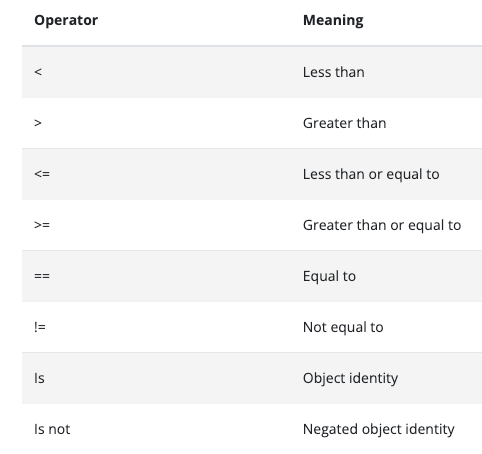
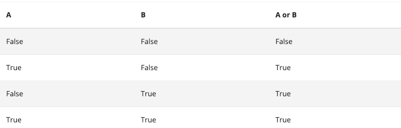
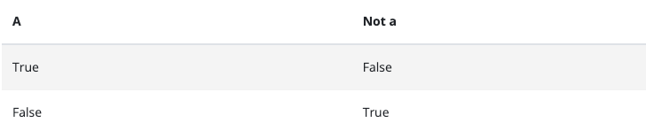

# Booleans:
- A boolean is a binary data type that evaluates to either True or False.

# Comparision Operators
- There are eight comparison operators in Python. 


# Logical Operators
- A logical operator is a word or symbol that evaluates two or more Boolean expressions to be either a true or false value. The result of the statement is dependent on the type of logical operator used. Generally, in programming, there are three major types of logical operators. `AND`, `OR`, and `NOT`.

## AND OPERATORS
- AND operator takes a strict approach to evaluate boolean expressions. If either one is false, then it evaluates to false. It only gives a true output when `all the expressions are true`.


## OR Operators
- OR logical operator takes a more relaxed approach while evaluating boolean expressions. If either one of the expressions is true, then it evaluates to true. It also uses a short circuit evaluation method. Once the first expression is true, it doesn’t bother checking the rest and simply returns a true. But if the first is false, it runs through the others until it finds a true and returns it, else it returns false.


## NOT Operators
- NOT logical operator negates a boolean value. It returns a true when the expression is false and vice versa. If a value is false, the NOT value becomes true, and the program executes. If a value is true, the NOT value becomes false, and the program does not run.


## List 

## Immutable objects
- when an object is described as `immutable`, that means it cannot be changed
- The following `immutable` types are built into python
  - int
  - float
  - bool (True and False): a subclass of `int`
  - str (string)
  - tuple
  - frozenset
  - bytes
  - 
## Mutable objects
- A Mutable object is one whose value can be changed
- Python has the following `mutable` object built in:
  - list
  - dict
  - set
  - Bytearray

## Difference between `immutable` and `immutable`

- An immutable object can't be changed. You can create a new object, and use the same variable name for it, but you can't change the value of a immutable object
- `Mutable` objects, such as lists, `can` be changed

```commandline
Strings are immutable. When we tried to change a string. Python created a new object : a new string - and re-attached the name to it. 

Lists are immutable - they can be changed. When we appended a new item, Python was able to change the contents of the list, without creating a new one.
```

## Methods and Functions
- A method is the same as a function, except that it's bound to an object

### Function:
 - min
 - max
 - len

## Enumerate:
- Enumerate returns pairs of values 

## Tuples:
- A `tuple` is a mathematical name for an ordered set of data
- In python, tuples are another sequence type; along with strings, list and ranges
- Tuples differs from list because tuples are `immutable`. That means they can't be changed after they're created - just like string
- always use it in parentheses ()

## Constant
- A constant is a fixed value that does not change
- All in capital and should not change
- example: 
  - PI: The ratio of a circle's circumference to its diameter = 3.141592653589790
  - e: the base of natural logarithms = 2.718281828
  - 

## Mehohod
- a function that's bound to an instance of a class is called method.
- 

## funciton
- def functionName(parameters name):
- `parameters()` are like placeholders for the real values that we'll pass to the function
- They are just variable, but they're given a value when you call the function.
- it can also be referred to as formal parameters
- `Arguments` are the values that will be used by `formal parameters`, when we call a function.
- Each parameter must be given a value, by providing an `argument` in the function call.
- Providing values as arguments is called `passing` the arguments
- if a function defines two parameter, we `pass` two arguments to it when we call it.
- `Positional argument` are assigned to the parameters in the order they appear.
- In fact, the arguments in this example are really called `positional-or-keyword` arguments.
- 

# RESOURCES
- [Truth Value](https://docs.python.org/3/library/stdtypes.html)
- [String Method](https://docs.python.org/3/library/stdtypes.html#string-methods)
- [Bulit-in-function](https://docs.python.org/3/library/functions.html)
- [Operator precedence](https://docs.python.org/3/reference/expressions.html#operator-precedence)
- [pip8](https://peps.python.org/pep-0008/)
- [Sequence Type](https://docs.python.org/3/library/stdtypes.html#sequence-types-list-tuple-range)
- [id](https://docs.python.org/3/library/functions.html#id)
- [Mutable Sequence Types](https://docs.python.org/3/library/stdtypes.html#mutable-sequence-types)
- [Built-in Functions](https://docs.python.org/3/library/functions.html)
- [Mutable Sequence Types](https://docs.python.org/3/library/stdtypes.html#mutable-sequence-types)
- [pip 8 style guide](https://peps.python.org/pep-0008/)
- [Google style guide](https://google.github.io/styleguide/pyguide.html)
- [Built in functions](https://docs.python.org/3/library/functions.html)
- [Lists](https://docs.python.org/3/library/stdtypes.html#typesseq-list)
- [Common Sequence Operations](https://docs.python.org/3/library/stdtypes.html#common-sequence-operations)
- [Constants](https://peps.python.org/pep-0008/#constants)
- [funciton](https://docs.python.org/3/faq/programming.html#how-do-i-write-a-function-with-output-parameters-call-by-reference)
- [call by sharing](https://en.wikipedia.org/wiki/Evaluation_strategy#Call_by_sharing)
- [String Method](https://docs.python.org/3/library/stdtypes.html#string-methods)


# Notes
- casefold() - converts to lower case
- isalnum() - alpha numeric
- isalpha() - alphabetic character, decimal, digit, numeric
