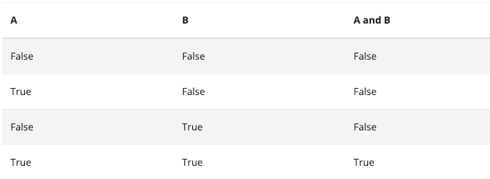

# Booleans:
- A boolean is a binary data type that evaluates to either True or False.

# Comparision Operators
- There are eight comparison operators in Python. 

# Logical Operators
- A logical operator is a word or symbol that evaluates two or more Boolean expressions to be either a true or false value. The result of the statement is dependent on the type of logical operator used. Generally, in programming, there are three major types of logical operators. `AND`, `OR`, and `NOT`.

## AND OPERATORS
- AND operator takes a strict approach to evaluate boolean expressions. If either one is false, then it evaluates to false. It only gives a true output when `all the expressions are true`.

## OR Operators
- OR logical operator takes a more relaxed approach while evaluating boolean expressions. If either one of the expressions is true, then it evaluates to true. It also uses a short circuit evaluation method. Once the first expression is true, it doesn’t bother checking the rest and simply returns a true. But if the first is false, it runs through the others until it finds a true and returns it, else it returns false.

## NOT Operators
- NOT logical operator negates a boolean value. It returns a true when the expression is false and vice versa. If a value is false, the NOT value becomes true, and the program executes. If a value is true, the NOT value becomes false, and the program does not run.

# RESOURCES
- [Truth Value](https://docs.python.org/3/library/stdtypes.html)
- [String Method](https://docs.python.org/3/library/stdtypes.html#string-methods)
- [Bulit-in-function](https://docs.python.org/3/library/functions.html)
- 
